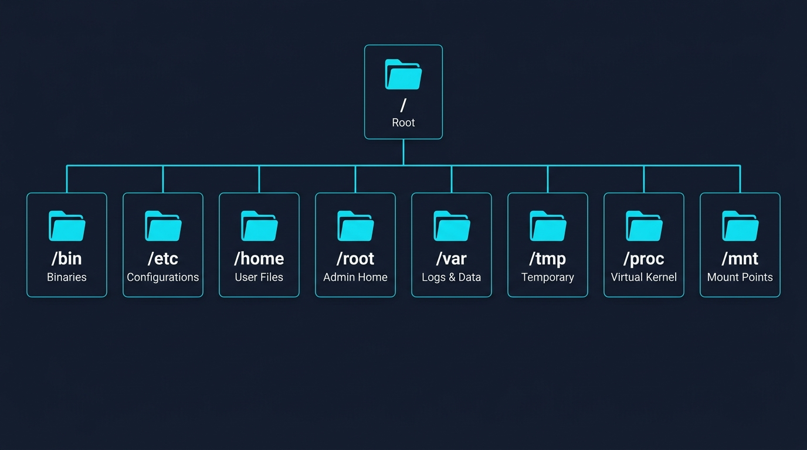
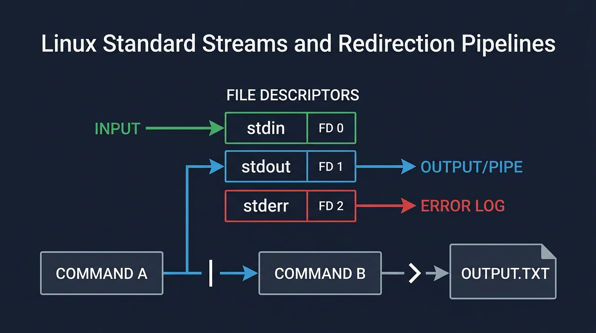
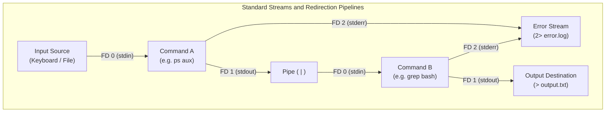
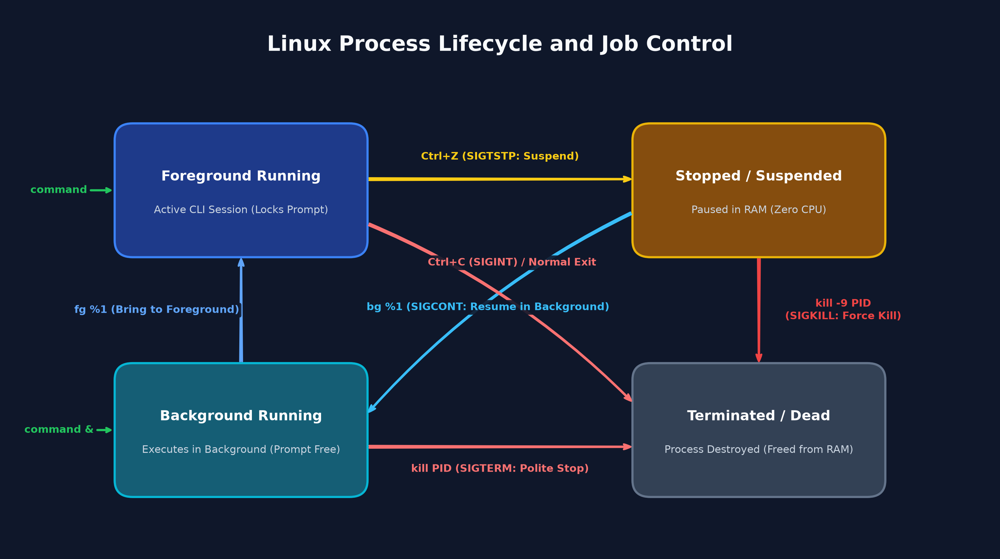
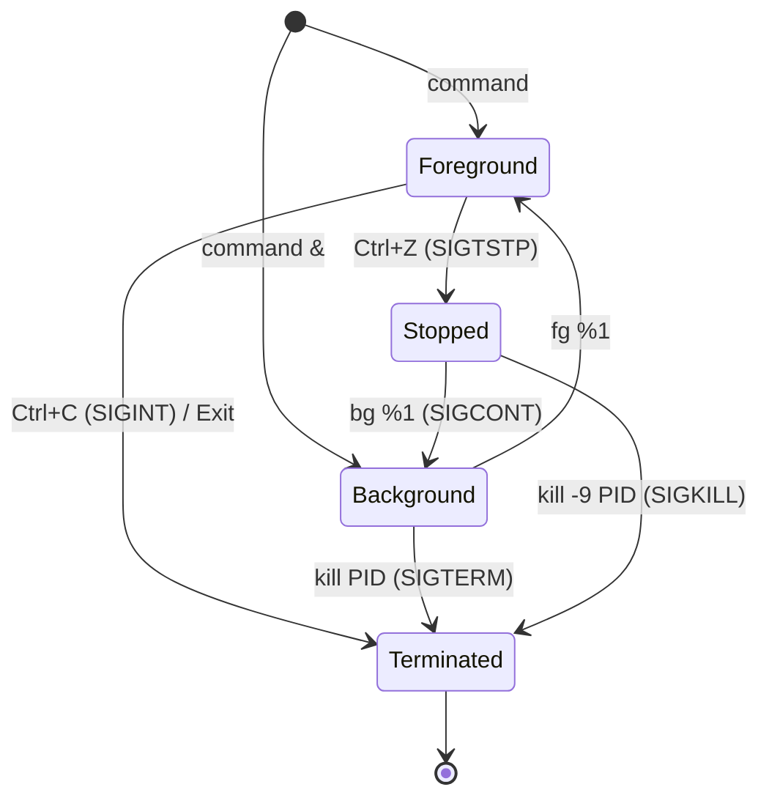

# Module 1: Fundamentals, Tooling & Processes — Student Handout

## 1. Local Environment Setup & VM Lifecycle

### Windows (WSL 2)
```powershell
# 1. Create & install instance (Run in PowerShell Admin):
wsl --install -d Ubuntu --name devops-vm
# (Reboot PC when prompted, then complete initial username and password setup)

# 2. List & check status of all instances:
wsl -l -v

# 3. Start & Attach (launch interactive Linux shell):
wsl -d devops-vm

# 4. Detach (exit shell back to Windows PowerShell - run inside Linux):
exit   # or press Ctrl+D

# 5. Stop a specific running instance (run in PowerShell):
wsl --terminate devops-vm   # or: wsl -t devops-vm

# 6. Stop all running WSL instances (complete hypervisor shutdown):
wsl --shutdown
```
- **Password input:** Keystrokes are invisible while typing in Linux (shoulder-surfing protection).
- **Initial update:** Inside the shell, run `sudo apt update && sudo apt upgrade -y`.

### macOS (Multipass)
```bash
# 1. Install Multipass via Homebrew (Run in macOS Terminal):
brew install --cask multipass

# 2. Create & launch instance:
multipass launch --name devops-vm --cpus 2 --memory 2G --disk 10G

# 3. List & check status of all VMs:
multipass list
multipass info devops-vm

# 4. Start instance (boots VM in background):
multipass start devops-vm

# 5. Attach (open interactive shell inside VM):
multipass shell devops-vm

# 6. Detach (exit shell back to macOS Terminal - run inside Linux):
exit   # or press Ctrl+D (VM remains running in background)

# 7. Stop instance (graceful shutdown):
multipass stop devops-vm

# 8. Delete & Purge (cleanup when destroying instance):
multipass delete devops-vm && multipass purge
```
- **Password requirement:** Multipass instances create the default `ubuntu` account without a password. Inside `devops-vm`, run `sudo passwd ubuntu` to set one immediately (required for `sudo` commands).
- **Initial update:** Run `sudo apt update && sudo apt upgrade -y`.

---

## 2. Core Linux Architecture

- **Kernel:** Core engine scheduling CPU, memory, storage devices, and network interfaces.
- **Shell (`bash`):** Command-line interpreter converting user commands into kernel instructions.
- **Headless Server:** Production Linux runs with no GUI/desktop. Consumes minimal RAM, boots instantly, and is managed entirely via CLI/SSH.
- **"Everything is a File":** Disks, hardware devices, process statistics (`/proc`), and configuration are exposed as readable files in the filesystem.

---

## 3. Filesystem Hierarchy Standard (FHS)

Linux uses a single unified tree starting at `/` (root). No drive letters.



| Directory | Purpose | Common Contents |
| :--- | :--- | :--- |
| `/` | System root | Base of the entire filesystem |
| `/bin`, `/usr/bin` | User binaries | Standard commands (`ls`, `cp`, `bash`, `nano`) |
| `/etc` | System configuration | Plain-text service configs (`hosts`, `nginx.conf`) |
| `/home` | User workspaces | `/home/student/` (user personal files) |
| `/root` | Superuser home | Private home folder of the root administrator |
| `/var` | Variable dynamic data | System logs (`/var/log/`), web roots (`/var/www/`) |
| `/tmp` | Temporary scratchpad | Ephemeral files cleared on system reboot |
| `/proc` | Kernel runtime states | Virtual in-memory statistics (`/proc/cpuinfo`) |
| `/mnt` | Mount points | Access host drives (e.g., `/mnt/c` on WSL 2) |

### Path Syntax & Shortcuts
- **Absolute Path:** Starts with `/`. Points to exact location from root (`/var/log/dpkg.log`). Works anywhere.
- **Relative Path:** Does not start with `/`. Location relative to current directory (`../configs/app.conf`).
- `.` = Current working directory
- `..` = Parent directory (one level up)
- `~` = Current user's home directory (`/home/<username>`)
- `-` = Previous working directory (`cd -` returns to last folder)

---

## 4. File & Directory Management

### Navigation & Discovery
- `pwd` — Print current working directory path.
- `ls` — List visible files in directory.
- `ls -l` — Detailed long listing (permissions, owner, size, timestamp).
- `ls -la` — Long listing including hidden dotfiles (`.`).
- `ls -lh` — Long listing with human-readable sizes (K, M, G).
- `ls -lt` — Sort files by modification time (newest first).
- `ls -lart` — Reverse time sort; newest modified files appear at the bottom of the screen.
- `ls -ld [dir]` — Inspect directory metadata rather than its contents.
- `ls -R` — Recursively list all subdirectories and files.
- `cd [path]` — Change working directory (`cd /etc`, `cd ~`, `cd ..`).

### File Operations
- `mkdir -p [dir/subdir]` — Create directory tree idempotently (no error if it already exists).
- `touch [file]` — Create empty file or update timestamp.
- `cp [src] [dst]` — Copy a file (`cp app.conf app.conf.bak`).
- `cp -r [src_dir] [dst_dir]` — Copy a directory recursively.
- `cp -a [src] [dst]` — Archive copy: preserves permissions, ownership, and timestamps.
- `mv [src] [dst]` — Move or rename a file or directory (`mv old.txt new.txt`).
- `rm [file]` — Permanently delete a file (no recycle bin!).
- `rm -r [dir]` — Permanently delete a directory and all its contents.
- `rm -rf [dir]` — Forcefully and recursively delete a directory without confirmation prompts.

### Writing Text & Output Redirection
- `echo "[text]"` — Print text string to the terminal screen (`echo "Hello DevOps"`).
- `echo "[text]" > [file]` — Write text to file, **overwriting** existing content (`echo "PORT=8080" > app.conf`).
- `echo "[text]" >> [file]` — Append text to end of file without overwriting (`echo "DEBUG=false" >> app.conf`).

---

## 5. Terminal Text Editing with Nano

Fast terminal text editor for editing configuration files over SSH.

```bash
nano /path/to/file.conf
```

### Essential Keyboard Shortcuts
- **Arrow keys:** Move cursor.
- `Ctrl+O` then `Enter`: Save changes (WriteOut).
- `Ctrl+X`: Exit editor (press `Y` then `Enter` to confirm changes if unsaved).
- `Ctrl+W`: Search text string ("Where Is").
- `Ctrl+K`: Cut current line.
- `Ctrl+U`: Paste cut line.

---

## 6. Text Inspection & Stream Filtering

### Reading Files
- `cat [file]` — Print entire file to screen (best for short files).
- `less [file]` — Interactive scrollable pager (best for large log files).
  - `g` = Jump to top of file
  - `G` = Jump to bottom of file
  - `/[term]` = Search forward (`n` moves to next match)
  - `q` = Quit pager
- `head -n [N] [file]` — Display first $N$ lines of file.
- `tail -n [N] [file]` — Display last $N$ lines of file.
- `tail -f [file]` — Follow / stream new file entries in real time (vital for watching active log files).

### Standard Streams & Pipelines
Every Linux process automatically opens three POSIX data streams (file descriptors):
- `0` (`stdin`) — Standard Input (keyboard or incoming data stream).
- `1` (`stdout`) — Standard Output (default destination for normal output).
- `2` (`stderr`) — Standard Error (default destination for error diagnostics).





### Searching & Pipes
- `grep "[pattern]" [file]` — Print lines matching pattern.
- `grep -i "[pattern]" [file]` — Case-insensitive search.
- `grep -rn "[pattern]" [dir]` — Search all files in directory recursively with line numbers.
- `grep -v "[pattern]" [file]` — Invert search: show lines that do NOT match the pattern (filter out noise).
- `[command] | grep "[pattern]"` — Pipe command output into grep filter.
  - *Example:* `ps aux | grep bash`

---

## 7. Package Management with APT

Ubuntu uses `apt` (Advanced Package Tool) to manage software from central repositories. Search packages and dependencies online via the official [Ubuntu Packages Search](https://packages.ubuntu.com/).

### Package Management & Inspection Workflow
```bash
# 1. Refresh local package catalog index (does not install or upgrade packages)
sudo apt update

# 2. Search repository for a tool
apt search [keyword]

# 3. View package metadata, version, and dependencies
apt show [package_name]

# 4. Install package without interactive prompts (-y assumes 'yes')
sudo apt install -y [package_name]

# 5. List installed packages (pipe to grep to search installed software)
apt list --installed | grep [keyword]

# 6. Upgrade all installed packages to latest versions
sudo apt upgrade -y
```

### Uninstallation & System Cleanup
```bash
# Standard uninstall (deletes binaries and libraries, preserves configuration files)
sudo apt remove -y [package_name]

# Complete purge (deletes binaries AND removes all configuration files)
sudo apt purge -y [package_name]

# Remove orphaned dependencies no longer needed by any installed software
sudo apt autoremove -y

# Clear downloaded .deb installer archive cache to free disk space
sudo apt clean
```

---

## 8. Processes, Resource Monitoring & Job Control

A **process** is an active program in RAM, identified by a unique numerical **PID (Process ID)**.

### Process Inspection
- `ps aux` — Snapshot of all running processes across the system.
  - `a` = All users
  - `u` = Include owner, CPU%, and MEM%
  - `x` = Include background daemons not tied to a terminal
- `top` — Real-time interactive resource monitor.
  - `Shift+P` = Sort by CPU consumption
  - `Shift+M` = Sort by Memory consumption
  - `q` = Quit
- `htop` — Modern visual process monitor.
  - `F5` = Toggle process tree view (shows PID 1 parent hierarchy)
  - `F6` = Sort by metric
  - `q` = Quit

### Background Job Control
- `[command] &` — Launch process in background immediately (`sleep 100 &`).
- `Ctrl+Z` — Suspend (pause) current foreground process.
- `jobs` — List active background jobs in current shell.
- `bg %[job_id]` — Resume suspended job in background (`bg %1`).
- `fg %[job_id]` — Bring background job to foreground (`fg %1`).

### Process Lifecycle & State Machine
Linux processes move through distinct scheduling and execution states in memory:





### Process Termination Signals
- `kill [PID]` — Send `SIGTERM` (15). Polite shutdown request.
- `kill -9 [PID]` — Send `SIGKILL` (9). Unblockable kernel force-kill.
- `pkill [name]` — Terminate all processes matching a name (`pkill sleep`).
- `Ctrl+C` — Send `SIGINT` (2) to halt current foreground command.

---

## 9. Host Storage Access

Access host files directly from the Linux CLI:
- **Windows (WSL 2):** Host C: drive mounted under `/mnt/c/`.
  ```bash
  ls /mnt/c/Users/<WindowsUser>/
  ```
- **macOS (Multipass):** Mount host directory into VM:
  ```bash
  multipass mount /Users/<MacUser>/Desktop devops-vm:/home/ubuntu/desktop
  ```

---

## 10. Practice & Next Steps
- Keep [linux_commands_cheat_sheet.md](./linux_commands_cheat_sheet.md) open for quick syntax lookups.
- Complete the practical challenges in [homework.md](./homework.md).
