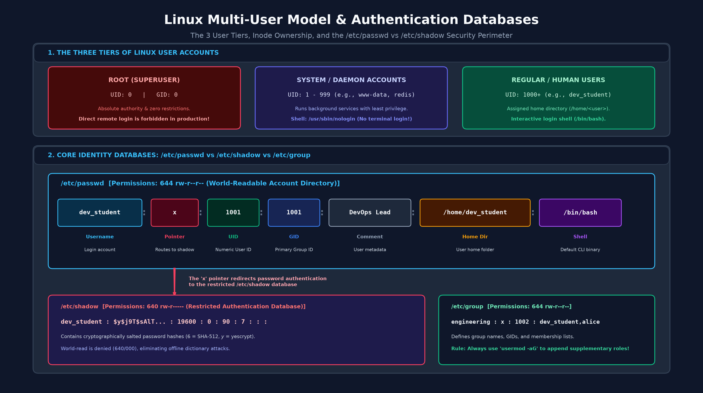
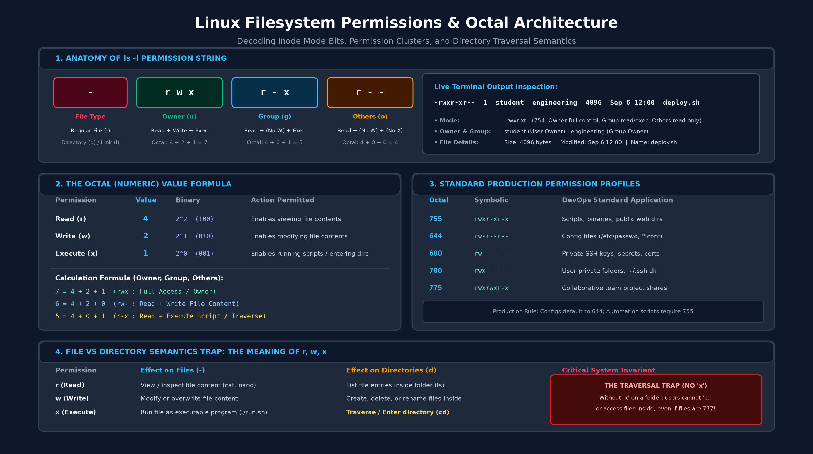
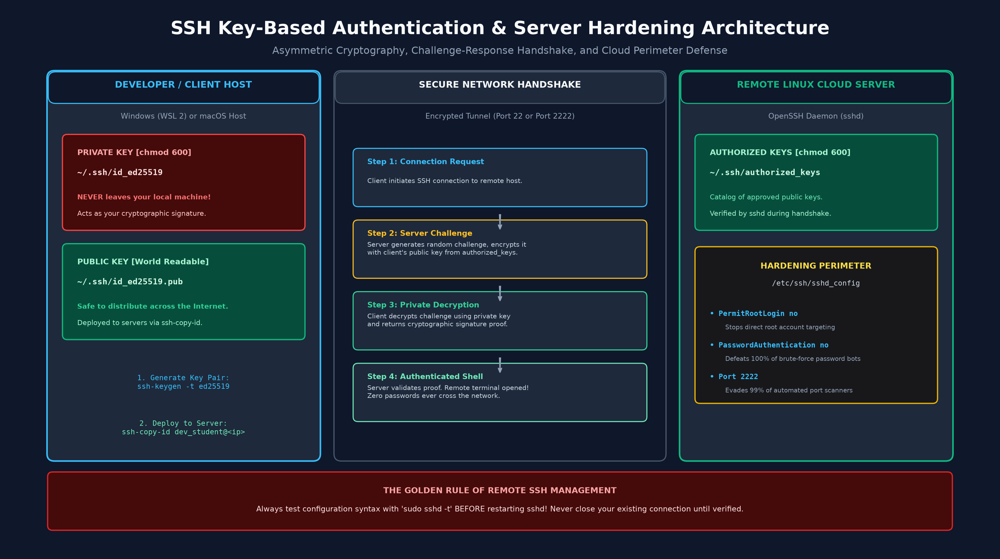

# Module 2: Security & Access Control — Student Handout

## 1. Linux Multi-User Architecture

Linux is designed from the ground up as a multi-user operating system. The kernel identifies all actors via numerical identifiers rather than usernames:

- **UID (User ID):** Numerical identity assigned to each account.
  - **UID 0:** The `root` superuser. Zero restrictions; full control over all processes and hardware.
  - **UID 1 – 999:** System / service accounts (e.g., `www-data`, `systemd-resolve`). Run background daemons under least privilege; configured with non-interactive shells (`/usr/sbin/nologin`).
  - **UID 1000+:** Regular human users. Assigned a home directory in `/home/<user>` and an interactive shell (`/bin/bash`).
- **GID (Group ID):** Numerical identity assigned to collections of users sharing common access permissions.

---

## 2. Core Account Databases

User account and authentication state is maintained in three plain-text configuration files in `/etc/`:

### `/etc/passwd` (Account Catalog — Permissions `644`)
World-readable list of user accounts on the system.
Format: `username:password_marker:UID:GID:comment:home_directory:shell`
- *Example:* `dev_student:x:1001:1001::/home/dev_student:/bin/bash`
- The `x` in field 2 indicates that the actual password hash is stored securely in `/etc/shadow`.

### `/etc/shadow` (Authentication Secrets — Permissions `640` or `000`)
Restricted file readable only by the `root` user and `shadow` group.
Format: `username:$algorithm$salt$hash:last_changed:min_days:max_days:warn_days:inactive_days:expire_date:reserved`
- Common hash identifiers: `$6$` (SHA-512), `$y$` (yescrypt on modern Ubuntu).

### `/etc/group` (Group Catalog — Permissions `644`)
World-readable list of system groups.
Format: `group_name:password_marker:GID:member1,member2,...`
- *Example:* `engineering:x:1002:dev_student`



---

## 3. User Administration Commands

Always use `useradd` for automated environments and scripts:

- `id` — Display current user UID, primary GID, and supplementary groups.
- `id [user]` — Display UID and group information for a specific account.
- `whoami` — Print current effective username.
- `sudo useradd -m -s [shell] [username]` — Create a new user with home directory (`-m`) and default shell (`-s /bin/bash`).
  - *Example:* `sudo useradd -m -s /bin/bash dev_student`
- `sudo passwd [username]` — Set or update password for an account. Keystrokes are not echoed to the terminal.
- `sudo passwd -l [username]` — Lock user account (prepends `!` to password hash in `/etc/shadow` to disable password login).
- `sudo passwd -u [username]` — Unlock a previously locked user account.
- `sudo passwd -S [username]` — Display password status (`P` = active, `L` = locked, `NP` = no password).
- `sudo usermod -aG [group] [username]` — Append a user to a supplementary group.
  - *Warning:* Omitting `-a` (`usermod -G`) replaces all existing secondary groups, stripping the user of other memberships!
- `sudo userdel -r [username]` — Delete user account along with their home directory and mail spool (`-r`).

---

## 4. Group Administration Commands

- `groups` — List group memberships of the current user.
- `groups [user]` — List group memberships of a specific user.
- `sudo groupadd [group_name]` — Create a new group.
  - *Example:* `sudo groupadd engineering`
- `sudo gpasswd -d [user] [group]` — Remove a specific user from a group.
- `sudo groupdel [group_name]` — Delete a group from the system.

---

## 5. User Switching & Environment Transitions

- `su [user]` — Switch to user while retaining the current environment, PATH, and working directory.
- `su - [user]` — Perform a clean login switch. Changes directory to `/home/<user>` and re-initializes all environment variables from scratch. **Recommended default.**
- `exit` (or `Ctrl+D`) — Terminate the current shell session and return to the parent shell.

---

## 6. Filesystem Permissions: Read, Write, Execute (rwx)

Every file and directory carries a 9-character permission string representing three user tiers:
1. **User / Owner (`u`):** The individual account that owns the file.
2. **Group (`g`):** The group assigned to the file.
3. **Others (`o`):** Every other account on the system.

### Decoding `ls -l`
```text
-  r w -  r - -  r - -    1  student  student  4096  Sep 3  12:00  app.conf
│  └──┬──┘ └──┬──┘ └──┬──┘
│     │       │       └── Others: Read-only (r--)
│     │       └────────── Group: Read-only (r--)
│     └────────────────── Owner: Read and Write (rw-)
└──────────────────────── File Type: - (file), d (directory), l (symlink)
```

### Permissions Semantics: Files vs. Directories

| Permission | Effect on Files | Effect on Directories |
| :--- | :--- | :--- |
| **`r` (Read)** | Read file contents (`cat`, `nano`) | List files within the directory (`ls`) |
| **`w` (Write)** | Modify or overwrite file contents | Create, rename, or delete files inside directory |
| **`x` (Execute)** | Execute file as a binary or script | **Traverse / Enter** directory (`cd`), access internal files |

> [!IMPORTANT]
> If a directory lacks execute (`x`) permission, users cannot `cd` into it or access any file inside it, even if individual files inside have full `rwxrwxrwx` permissions.



---

## 7. Permission Modification: Symbolic & Octal

### Symbolic Mode (`chmod [who][op][perm] [file]`)
- **Who:** `u` (user/owner), `g` (group), `o` (others), `a` (all: `ugo`).
- **Operators:** `+` (grant), `-` (revoke), `=` (set explicitly).
- **Permissions:** `r` (read), `w` (write), `x` (execute).
- *Examples:*
  - `chmod u+x script.sh` — Grant execute to owner.
  - `chmod g+w,o-r notes.txt` — Add write to group, remove read from others.
  - `chmod a=r public.txt` — Set read-only for everyone.

### Octal / Numeric Mode (`chmod [octal] [file]`)
Each permission bit has a numerical value:
- **Read = 4**
- **Write = 2**
- **Execute = 1**

Add values together for each category (Owner, Group, Others):

| Octal | Permission | Meaning | Common Usage |
| :---: | :---: | :--- | :--- |
| **`755`** | `rwxr-xr-x` | Owner full; Group/Others read and traverse | Executable scripts, public directories |
| **`644`** | `rw-r--r--` | Owner read/write; Group/Others read only | Standard configuration and text files |
| **`600`** | `rw-------` | Only Owner read/write; others completely locked out | Private SSH keys, password files |
| **`700`** | `rwx------` | Only Owner full access; others locked out | Private user folders, `.ssh` directory |
| **`775`** | `rwxrwxr-x` | Owner and Group full access; others read only | Collaborative team directories |

---

## 8. Ownership Management

- `sudo chown [user] [file]` — Change file owner.
- `sudo chown [user]:[group] [file]` — Change owner and group simultaneously.
  - *Example:* `sudo chown dev_student:engineering /srv/engineering`
- `sudo chgrp [group] [file]` — Change group ownership.
- `sudo chown -R [user]:[group] [directory]` — Recursively change ownership for an entire directory tree.

---

## 9. Privilege Escalation & Sudo Delegation

Direct root logins are disabled in production systems to preserve accountability and mitigate accidental destruction. Administrative tasks are delegated via `sudo` (SuperUser DO).

### Sudo Rules & Mechanics
- Running a command with `sudo` checks the security policy in `/etc/sudoers`.
- Authentication requests **your user password**, verifying your identity.
- Commands, timestamps, and usernames are permanently recorded in the system audit log.

### Sudoers Syntax Breakdown
```text
dev_student  ALL=(ALL:ALL)  /usr/bin/apt update
    │         │     │               └── Permitted command path
    │         │     └────────────────── Allowed execution users:groups
    │         └──────────────────────── Host machines (ALL = any server)
    └────────────────────────────────── User account (or %group_name)
```

### Safety Rules for Sudo Management
- **Never** edit `/etc/sudoers` with standard editors (`nano`, `vim`).
- Always use **`sudo visudo`**, which locks the file against race conditions and validates syntax before saving.
- Place modular delegation rules inside `/etc/sudoers.d/` rather than modifying `/etc/sudoers` directly:
  ```bash
  echo "dev_student ALL=(ALL) NOPASSWD: /usr/bin/apt update" | sudo EDITOR='tee' visudo -f /etc/sudoers.d/dev_student
  ```
- Validate all drop-in files: `sudo visudo -cf /etc/sudoers.d/dev_student`.
- Check active user privileges: `sudo -l`.

---

## 10. SSH Hardening Principles & Key Authentication

Production servers are managed remotely via SSH (Port 22). Configuration is controlled via `/etc/ssh/sshd_config`.

### Key Hardening Directives
- `PermitRootLogin no` — Prohibits logging in directly as root. Requires logging in as a named user, then elevating with `sudo`.
- `PasswordAuthentication no` — Prohibits password authentication; requires cryptographic SSH key pairs.
- `Port [number]` — Changes SSH listening port from 22 to reduce automated scanner noise.



### SSH Client Workflow
```bash
# 1. Generate modern cryptographic key pair on client machine
ssh-keygen -t ed25519 -C "student@devops"

# 2. Copy public key to remote host (installs to ~/.ssh/authorized_keys)
ssh-copy-id dev_student@<remote_ip>

# 3. Connect using private key
ssh -i ~/.ssh/id_ed25519 dev_student@<remote_ip>
```

### Configuration Testing & Service Restart Rule
Before restarting the SSH daemon, verify syntax to prevent remote lockout:
```bash
# Test syntax (exit code 0 = valid)
sudo sshd -t

# Restart SSH service to apply changes
sudo systemctl restart ssh
sudo systemctl status ssh
```

---

## 11. Security Auditing & Session Forensics

- `who` — List currently logged-in users and their terminal devices (`pts/0`).
- `w` — Display active users, current idle times, and the command each user is currently executing (`WHAT`).
- `last -n [count]` — Display history of recent successful logins, logouts, and system reboots.
- `lastlog` — Display the most recent login timestamp for every user on the system.
- `find [dir] -perm 777` — Audit filesystem to detect insecure world-writable files or directories.

---

## 12. Practice & Next Steps
- Keep [linux_commands_cheat_sheet.md](./linux_commands_cheat_sheet.md) open for quick syntax lookups.
- Complete the security challenges in [homework.md](./homework.md).
