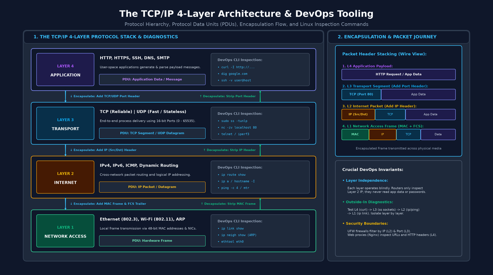
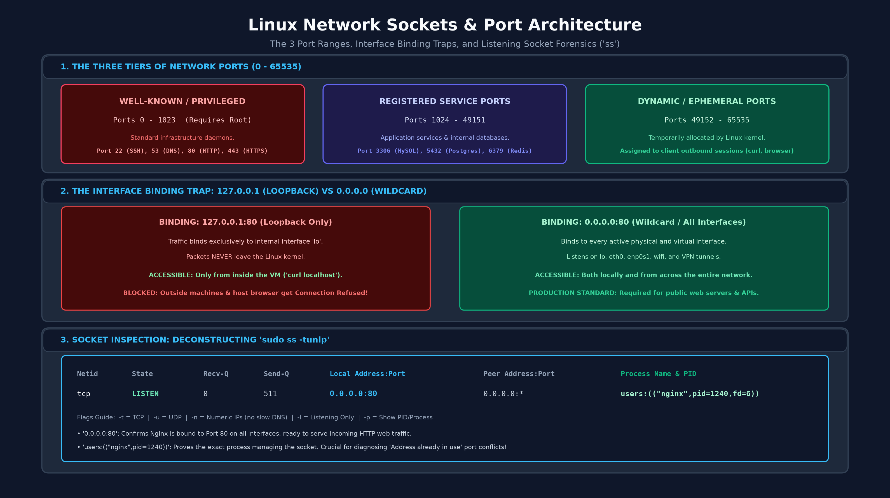
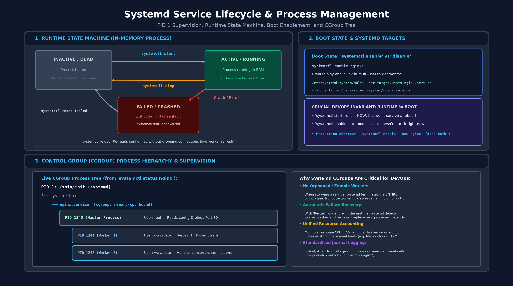
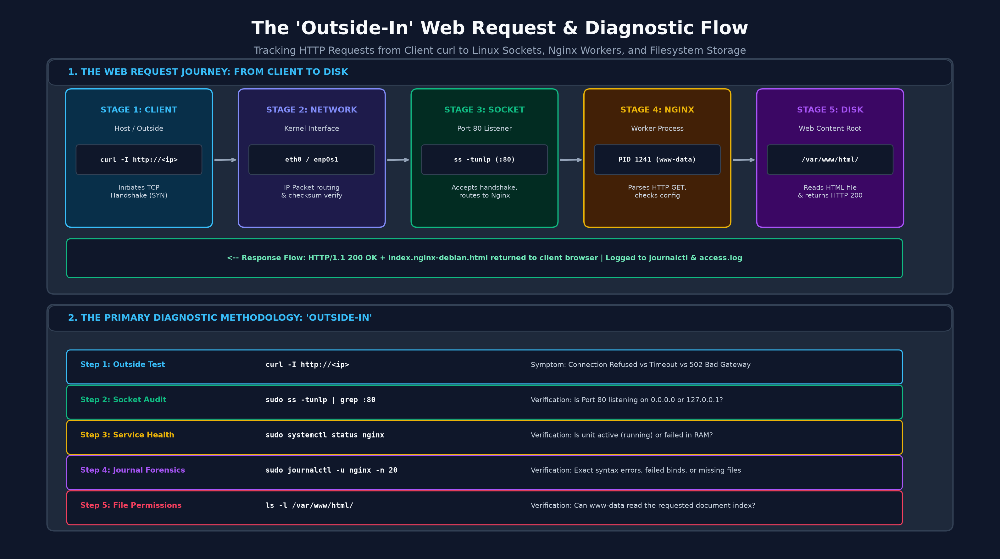

# Module 3: Networking Essentials & Services — Student Handout

## 1. The TCP/IP 4-Layer Model

Modern computer networking follows the practical 4-layer TCP/IP protocol suite:

1. **Application Layer:** Protocols that applications use to exchange data (HTTP, HTTPS, SSH, DNS, SMTP).
2. **Transport Layer:** End-to-end process communication. Manages port numbers and delivery guarantees (TCP, UDP).
3. **Internet Layer:** Logical addressing and cross-network packet routing (IPv4, IPv6, ICMP).
4. **Network Access / Link Layer:** Physical transmission across local hardware media using MAC addresses (Ethernet, Wi-Fi).



### TCP vs. UDP
- **TCP (Transmission Control Protocol):** Connection-oriented, reliable, ordered. Establishes sessions via the 3-way handshake (`SYN` $\rightarrow$ `SYN-ACK` $\rightarrow$ `ACK`). Ideal for HTTP, SSH, databases.
- **UDP (User Datagram Protocol):** Connectionless, unordered, minimal overhead ("fire-and-forget"). Ideal for DNS, video streaming, VoIP.

---

## 2. DNS Architecture & Record Types

The Domain Name System (DNS) maps human-readable names to routable IP addresses.

### Common DNS Record Types
- **A:** Maps hostname to an IPv4 address (`example.com -> 93.184.216.34`).
- **AAAA:** Maps hostname to an IPv6 address.
- **CNAME (Canonical Name):** Alias pointing one domain name to another (`www.example.com -> example.com`).
- **MX (Mail Exchange):** Identifies mail servers responsible for accepting domain email.
- **TXT:** Stores arbitrary text attributes (used for SPF/DKIM verification and domain ownership validation).
- **PTR (Pointer):** Reverse DNS record mapping an IP address back to a domain name.

### DNS Query Hierarchy
Recursive Resolver (e.g. `8.8.8.8`) $\rightarrow$ Root Nameservers (`.`) $\rightarrow$ Top-Level Domain (TLD) Nameservers (`.com`) $\rightarrow$ Authoritative Nameserver.

---

## 3. DNS Investigation Commands (`dig`)

- `dig [domain]` — Standard DNS query; inspect the `ANSWER SECTION` for returned records.
- `dig +short [domain]` — Return only the resolved IP address (clean output for scripts).
- `dig [domain] [record_type]` — Query specific record type (`dig google.com MX`, `dig google.com TXT`).
- `dig @[resolver_ip] [domain]` — Query a specific upstream DNS server (`dig @1.1.1.1 google.com`).
- `dig [domain] +trace` — Trace the complete recursive lookup from root nameservers to authoritative source.
- `dig -x [ip_address]` — Perform reverse DNS lookup to find the associated PTR record.

---

## 4. IP Addressing & RFC 1918 Private Subnets

- **IPv4:** 32-bit addresses divided into 4 octets (`0.0.0.0` to `255.255.255.255`).
- **IPv6:** 128-bit hexadecimal addresses.

### RFC 1918 Private Address Ranges (Non-Internet Routable)
- `10.0.0.0` – `10.255.255.255` (Class A: Enterprise corporate networks, Cloud VPCs)
- `172.16.0.0` – `172.31.255.255` (Class B: Container bridges, WSL 2 NAT)
- `192.168.0.0` – `192.168.255.255` (Class C: Home routers, local subnets)
- `127.0.0.1` — **Loopback interface (`localhost`)**: Internal to the local operating system kernel.

---

## 5. Network Interfaces & Routing (`ip`)

The `iproute2` package replaces deprecated tools (`ifconfig`, `netstat`, `route`).

- `ip link show` — List physical and virtual interfaces and their operational states (`UP`/`DOWN`).
- `ip a` (or `ip addr show`) — Display all assigned IPv4 and IPv6 addresses.
- `ip -br a` — Display brief, one-line summaries of active interfaces and assigned IPs.
- `ip r` (or `ip route show`) — Display the kernel IP routing table.
  - The line beginning with `default via [gateway_ip]` indicates the **Default Gateway** (router).
- `hostname -I` — Print all assigned internal IP addresses separated by spaces.
- `curl -s ifconfig.me` — Discover the external public IP address assigned to your outbound connection.

---

## 6. Ports & Network Sockets

A **Port** (0 – 65535) is a 16-bit numerical identifier directing incoming network packets to a specific application process:

- **0 – 1023 (Well-Known / Privileged Ports):** Require root / administrative privileges to bind.
  - Port 22: SSH (Secure Shell)
  - Port 53: DNS
  - Port 80: HTTP (Unencrypted Web)
  - Port 443: HTTPS (Encrypted Web)
- **1024 – 49151 (Registered Ports):** Application services (e.g. 3306 MySQL, 5432 PostgreSQL, 6379 Redis, 8080 Alternative Web).
- **49152 – 65535 (Dynamic / Ephemeral Ports):** Temporary ports assigned by the kernel to outbound client connections.

### Binding Interfaces
- `127.0.0.1:80` — Service binds strictly to loopback. Accessible **only** from the local machine.
- `0.0.0.0:80` (or `*:80`) — Service binds to **all** network interfaces. Accessible from external machines across the network.



---

## 7. Socket Inspection with `ss`

`ss` (Socket Statistics) is the high-performance replacement for `netstat`:

- `sudo ss -tunlp` — List all active listening TCP and UDP sockets with owning process names and PIDs.
  - `-t`: TCP sockets
  - `-u`: UDP sockets
  - `-n`: Numeric IP and port representation (prevents slow DNS resolution)
  - `-l`: Listening sockets only
  - `-p`: Show process name and PID (requires `sudo`)
- `sudo ss -tunlp | grep :80` — Filter for sockets bound to Port 80.
- `ss -ta` — Show all TCP sockets (both listening and active established connections).

---

## 8. Systemd Service Lifecycle (`systemctl`)

Systemd is the primary system and service manager (PID 1) on modern Linux distributions.



### Service Runtime Control
- `sudo systemctl start [service]` — Start service immediately in RAM.
- `sudo systemctl stop [service]` — Halt running service process tree.
- `sudo systemctl restart [service]` — Stop and restart service.
- `sudo systemctl reload [service]` — Reload configuration files without dropping active connections.
- `systemctl status [service]` — Inspect service runtime state, active PID, cgroup tree, and recent log snippets.
- `systemctl is-active [service]` — Check if service is currently running (`active` or `inactive`).

### Service Boot Control
- `sudo systemctl enable [service]` — Configure service to launch automatically on operating system boot.
- `sudo systemctl disable [service]` — Prevent service from launching on boot.
- `systemctl is-enabled [service]` — Check boot configuration (`enabled` or `disabled`).
- `sudo systemctl daemon-reload` — Reload systemd manager configuration after editing or creating unit files.
- `systemctl list-units --type=service --state=running` — Enumerate all active background services.

---

## 9. Web Server Deployment: Nginx

Nginx is an industry-standard, high-performance reverse proxy and HTTP web server.

```bash
# 1. Install Nginx
sudo apt update && sudo apt install -y nginx

# 2. Launch and enable service
sudo systemctl start nginx
sudo systemctl enable nginx

# 3. Verify listening socket
sudo ss -tunlp | grep :80

# 4. Default web root
# Static web content resides in /var/www/html/index.nginx-debian.html
```



---

## 10. Web Diagnostics & Connectivity Tools

### `curl` (Client URL)
- `curl [url]` — Issue HTTP GET request and print response body to stdout.
- `curl -I [url]` — Fetch HTTP headers only (inspect HTTP status code and Server headers).
- `curl -v [url]` — Verbose mode: display full connection lifecycle, DNS lookup, TCP handshake, and TLS exchange.
- `curl -s [url]` — Silent mode: suppresses progress meters (ideal for scripting).
- `curl -o [file] [url]` — Download remote content and save to designated filename.
- `curl -O [url]` — Download remote file preserving remote filename.
- `curl -L [url]` — Follow HTTP redirects (301 / 302).
- `curl -k [url]` — Allow insecure SSL/TLS connections (bypasses self-signed certificate warnings).

### `nc` (Netcat)
- `nc -zv [host] [port]` — Test TCP port connectivity without sending data.
  - *Example:* `nc -zv localhost 80`

### `ping` & Path Diagnostics (`mtr`)
- `ping -c [count] [host]` — Send ICMP Echo Request packets to verify layer 3 IP reachability.
  - *Warning:* Many cloud providers and corporate firewalls drop ICMP packets while allowing TCP web traffic.
- `mtr -t [host]` — Combined ping and traceroute utility in terminal mode: identifies packet loss across all router hops.

---

## 11. Systemd Journal Querying (`journalctl`)

Systemd aggregates service and kernel logs into a unified binary journal:

- `sudo journalctl -u [service]` — Filter logs specifically for a designated service unit.
  - *Example:* `sudo journalctl -u nginx`
- `sudo journalctl -xeu [service]` — High-priority failure triage: displays the end of the log (`-e`) with explanatory catalog notes (`-x`).
- `sudo journalctl -u [service] -f` — Follow service log output in real-time (live stream).
- `sudo journalctl -u [service] -n [lines] --no-pager` — Print the last $N$ lines of service logs.
- `sudo journalctl -u [service] --since "15 minutes ago"` — Filter events by time range.

---

## 12. Practice & Next Steps
- Keep [linux_commands_cheat_sheet.md](./linux_commands_cheat_sheet.md) open for quick syntax lookups.
- Complete the networking and service challenges in [homework.md](./homework.md).
