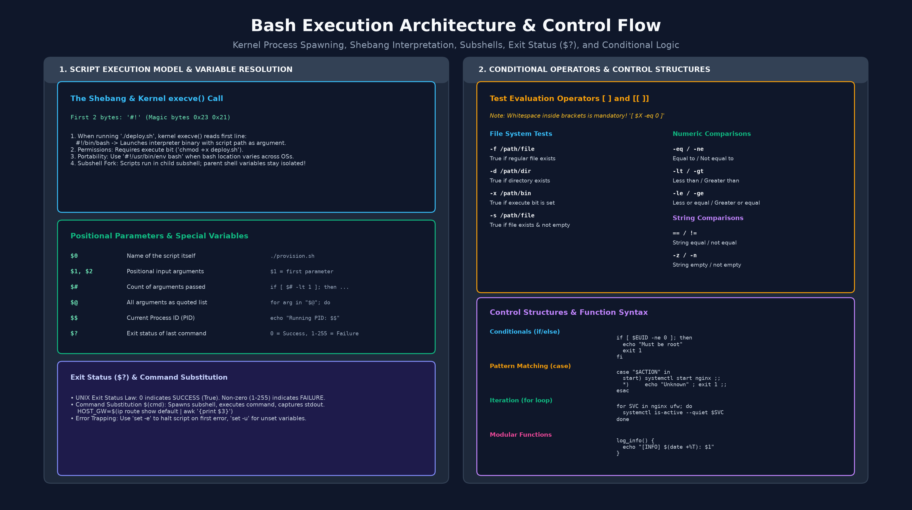
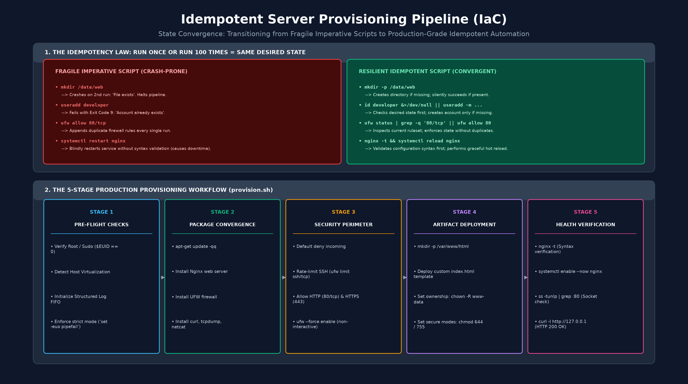

# Module 6: Bash Automation & Infrastructure Scripting — Student Handout

A comprehensive technical engineering guide to shell scripting, defensive execution standards, control structures, modular function design, and idempotent infrastructure provisioning.

---

## 1. The Automation Imperative & Bash Script Anatomy

In production DevOps engineering, manual command execution introduces human variance, configuration drift, and unrepeatable states. Shell scripting converts operational procedures into auditable, version-controlled, and repeatable software assets.



### 1.1 The Script Lifecycle & Kernel Execution Model

When an administrator executes a script file via `./deploy.sh` in an interactive shell, the Linux operating system follows a precise execution sequence:

1. **Magic Number Detection:** The Linux kernel `execve()` system call reads the initial bytes of the target file. If the first two bytes match the magic number `0x23 0x21` (ASCII characters `#!`, known as the shebang), the kernel stops treating the file as an ELF binary.
2. **Interpreter Invocation:** The kernel parses the path immediately following the shebang (typically `/bin/bash`) and executes that binary, passing the path of the script as its primary argument:
   ```text
   Kernel syscall: execve("/bin/bash", ["/bin/bash", "./deploy.sh"], [environment])
   ```
3. **The Execute Permission Bit:** Linux Discretionary Access Control (DAC) prevents the execution of any file lacking the execute bit (`x`). An automation script must be granted execute permission (`chmod +x script.sh`) before direct invocation. Without `+x`, the script can only be run by manually passing it to an interpreter instance (`bash script.sh`).
4. **Subshell Isolation vs. Sourcing:** Executing `./script.sh` forks a new child process running a subshell. Any variables exported, modified, or unset inside the subshell exist exclusively within that process memory and vanish upon exit. Conversely, sourcing a script (`source script.sh` or `. script.sh`) executes commands within the current shell session, persisting environment changes.

The following command demonstrates making a script executable and verifying its permissions using standard Linux file utilities:

```bash
chmod +x deploy.sh
ls -l deploy.sh
```

### 1.2 Shebang Portability Conventions

On modern Ubuntu and Debian systems, Bash resides at `/bin/bash` (which is typically a symlink to `/usr/bin/bash`). In heterogeneous environments spanning various Linux distributions, FreeBSD, or macOS, the absolute path to the shell binary can differ.

The following shebang declarations illustrate both standard and portable invocation styles:

```bash
#!/bin/bash
```

The alternative portable declaration queries the user's `PATH` environment variable at runtime to discover the active Bash binary:

```bash
#!/usr/bin/env bash
```

---

## 2. Variables, Parameters & Special Tokens

Bash operates primarily on untyped strings. Understanding variable assignment rules, quoting mechanisms, parameter expansions, and special shell tokens is required to prevent runtime bugs and security vulnerabilities.

### 2.1 Variable Declaration & Quoting Mechanics

In Bash, variable assignment syntax strictly prohibits whitespace surrounding the assignment operator (`=`). Inserting spaces causes the shell interpreter to misidentify the variable name as an executable command and the assigned value as its argument:

```bash
# Valid: No whitespace surrounding the assignment operator
APP_NAME="nginx"
PORT=80

# Invalid: Whitespace causes the shell to interpret the variable name as a command
# APP_NAME = "nginx"   # Error: command 'APP_NAME' not found
# PORT = 80            # Error: command 'PORT' not found
```

Quoting controls how the shell expands variables and interprets special characters:
- **Single Quotes (`'...'`):** Preserve the literal value of all enclosed characters. No parameter expansion, command substitution, or escape sequences are processed.
- **Double Quotes (`"..."`):** Allow parameter expansion (`$VAR`), command substitution (`$(cmd)`), and arithmetic evaluation, while preventing word splitting and pathname expansion (globbing).
- **Unquoted Variables:** Cause the shell to perform word splitting across whitespace and glob expansion, which frequently corrupts file paths containing spaces.

The following examples demonstrate how quoting choices alter variable evaluation in shell scripts:

```bash
SYSTEM_USER="deployer"

# Single quotes prevent expansion and treat text literally
echo 'The target user is $SYSTEM_USER'

# Double quotes expand the variable while preserving string boundaries
echo "The target user is $SYSTEM_USER"
```

### 2.2 Command Substitution & Arithmetic Expansion

Command substitution executes an external utility or pipeline in a subshell and returns its standard output into a variable. Arithmetic expansion evaluates basic integer operations without invoking external tools like `bc` or `expr`.

The following commands demonstrate capturing dynamic runtime metadata into variables and calculating integer values:

```bash
# Capture the active default gateway IP address
GATEWAY_IP=$(ip route show default | awk '{print $3}')

# Capture formatted ISO-8601 timestamp (format string attaches directly to '+' with no space)
TIMESTAMP=$(date +"%Y-%m-%d_%H-%M-%S")

# Perform integer arithmetic inside $(( ... ))
TOTAL_RETRIES=3
REMAINING_RETRIES=$((TOTAL_RETRIES - 1))
```

### 2.3 Special Variables and Positional Parameters

Bash populates dedicated read-only variables during process initialization to provide contextual execution data:

| Parameter | Scope | Description | Practical Use Case |
| :--- | :--- | :--- | :--- |
| **`$0`** | Execution | Name or path of the executing script file. | `echo "Usage: $0 <service_name>"` |
| **`$1`, `$2`...** | Input | Positional command-line arguments passed to the script. | `TARGET_HOST="$1"` |
| **`$#`** | Input | Total count of positional arguments passed. | `if [ "$#" -ne 2 ]; then ...` |
| **`$@`** | Input | All positional arguments as distinct quoted elements (`"$1" "$2"`). | `for item in "$@"; do ...` |
| **`$*`** | Input | All positional arguments collapsed into a single string (`"$1 $2"`). | Logging all passed arguments to a flat file |
| **`$$`** | Runtime | Process ID (PID) of the current executing shell instance. | Writing runtime PID tracking files |
| **`$?`** | Status | Exit code of the most recently executed foreground command. | Evaluating success or failure of previous command |
| **`$EUID`** | Identity | Effective user ID of the current execution context. | `if [ "$EUID" -ne 0 ]; then ...` (Root check) |

The following script snippet inspects positional arguments and confirms the presence of mandatory input parameters:

```bash
if [ "$#" -lt 1 ]; then
    echo "Usage: $0 <target_username>"
    exit 1
fi

TARGET_USER="$1"
echo "Initializing deployment workflow for: $TARGET_USER"
```

### 2.4 The UNIX Exit Status Law

Every command, pipeline, and script terminates with an integer return code between `0` and `255`:
- **`0` = Success (True):** The command completed without error.
- **`1 - 255` = Failure (False):** An error occurred (e.g., `1` general error, `2` misuse of shell builtins, `126` command invoked cannot execute, `127` command not found).

The following commands execute a diagnostic check and inspect the exit code using the special parameter `$?`:

```bash
systemctl is-active --quiet nginx
EXIT_STATUS=$?
echo "Nginx query returned exit status: $EXIT_STATUS"
```

---

## 3. Conditional Evaluation & Logic Operators

Control flow in Bash relies on evaluating exit statuses. The `test` command—invoked via single brackets `[ ]`—or the Bash-specific double bracket construct `[[ ]]` evaluate filesystem, string, and integer expressions.

### 3.1 Comparison Operators Reference

Whitespace immediately inside test brackets is syntactically mandatory. Writing `["$X" -eq 0]` causes execution failure because the shell attempts to locate a binary named `["$X"`.

The following conditional tests inspect filesystem metadata before performing modifications:

```bash
# -f: True if path exists and is a regular file
[ -f "/etc/nginx/nginx.conf" ]

# -d: True if path exists and is a directory
[ -d "/var/www/html" ]

# -e: True if path exists regardless of file type
[ -e "/var/run/web.pid" ]

# -x: True if file exists and execute permission is granted
[ -x "/usr/sbin/nginx" ]

# -s: True if file exists and has size greater than zero bytes
[ -s "/var/log/nginx/error.log" ]
```

Numeric comparison operators evaluate integers and must be written using letter abbreviations rather than mathematical symbols:

```bash
# Numeric equality and inequality
[ "$EUID" -eq 0 ]
[ "$ACTIVE_CONNECTIONS" -ne 0 ]

# Numeric magnitude comparison
[ "$DISK_USAGE_PERCENT" -gt 90 ]
[ "$RETRY_COUNT" -lt 5 ]
[ "$PROCESS_COUNT" -ge 1 ]
[ "$LOAD_AVERAGE" -le 10 ]
```

String comparison operators evaluate lexical values and string lengths:

```bash
# String equality and inequality
[ "$ENVIRONMENT" = "production" ]
[ "$SERVICE_STATUS" != "active" ]

# String length validation
[ -z "$CONFIG_FILE" ]   # True if string is empty (zero length)
[ -n "$CONFIG_FILE" ]   # True if string is non-empty
```

### 3.2 Single Brackets `[ ]` vs. Double Brackets `[[ ]]`

In modern Bash development, double brackets `[[ ]]` are strongly preferred over legacy single brackets `[ ]`:

- **Architectural Distinction:** `[` is actually a command (a shell built-in alias for `/usr/bin/test`) that evaluates arguments *after* standard shell parsing (word splitting and pathname globbing) has already executed. In contrast, `[[ ]]` is a shell keyword (compound command) parsed directly by the shell as a dedicated conditional expression.
- **No Word Splitting or Expansion Traps:** In `[ ]`, unquoted variables containing spaces or empty variables expand into multiple tokens or zero tokens, causing syntax errors (`[: too many arguments`). In `[[ ]]`, variables are evaluated safely without word splitting even if unquoted.
- **Native Boolean Logic:** `[[ ]]` natively supports standard `&&` and `||` logical operators within the expression. Single brackets rely on `-a` and `-o`, which POSIX explicitly marked as obsolescent and ambiguous in complex expressions.
- **Pattern Matching & Regular Expressions:** `[[ ]]` supports wildcard glob matching (`== *.tar.gz`) and regular expression evaluation via the `=~` operator.
- **Lexical Operators Without Escaping:** String comparison operators `<` and `>` function natively in `[[ ]]`, whereas `[ ]` treats them as stream redirection unless escaped (`\<`, `\>`).

| Feature | Single Brackets `[ ]` (POSIX Legacy) | Double Brackets `[[ ]]` (Modern Bash) |
| :--- | :--- | :--- |
| **Command Type** | Builtin / `/usr/bin/test` binary | Shell keyword (compound command) |
| **Word Splitting** | Yes (unquoted variables cause syntax errors) | No (variables evaluated safely) |
| **Logical Operators** | `-a` (AND), `-o` (OR) [Obsolescent] | `&&` (AND), `\|\|` (OR) [Standard] |
| **Pattern Matching** | No (exact literal match only) | Wildcard globs (`*`, `?`) and regex (`=~`) |
| **String `<` and `>`** | Requires escaping (`\<`, `\>`) | Native comparison |

The following example demonstrates word-splitting safety and compound evaluation using double brackets:

```bash
FILE_NAME="system audit log.txt"

# Single brackets fail here because $FILE_NAME splits into four tokens:
# [ $FILE_NAME = "system audit log.txt" ]  # Error: [: too many arguments

# Double brackets evaluate the variable as a single entity safely:
if [[ $FILE_NAME == "system audit log.txt" ]]; then
    echo "File match confirmed without quoting errors."
fi
```

---

## 4. Control Structures & Modularity

### 4.1 Branching (`if / elif / else`)

Branching constructs evaluate conditional expressions and direct script execution across discrete logical branches.

The following structure verifies administrative privileges and validates system dependencies before proceeding:

```bash
if [[ "$EUID" -ne 0 ]]; then
    echo "Error: Administrative privileges required. Execute with sudo." >&2
    exit 1
elif [[ ! -f "/etc/nginx/nginx.conf" ]]; then
    echo "Error: Nginx configuration file not found." >&2
    exit 2
else
    echo "Pre-flight validation checks completed successfully."
fi
```

### 4.2 Pattern Matching (`case`)

When evaluating a single variable against multiple enumerated options, `case` statements eliminate deeply nested conditional trees and enforce clean dispatching logic.

The following script pattern dispatches service lifecycle actions based on a command-line parameter:

```bash
# Safe default expansion: returns empty string if $1 is omitted, preventing set -u aborts
ACTION="${1:-}"

# Pattern matching: routes execution based on argument value
case "$ACTION" in
    start)
        systemctl start nginx
        ;;
    stop)
        systemctl stop nginx
        ;;
    restart|reload)
        nginx -t && systemctl reload nginx
        ;;
    status)
        systemctl status nginx
        ;;
    *)
        # Catch-all pattern: catches unexpected options or missing arguments
        echo "Usage: $0 {start|stop|restart|status}" >&2
        exit 1
        ;;
esac
```

### 4.3 Iteration (`for` and `while` Loops)

The `for` loop iterates over words in a string, items in an array, or files matched by shell globbing patterns.

The following loop iterates across a list of core daemons to evaluate and report their operational state:

```bash
for SERVICE_NAME in nginx ssh ufw; do
    if systemctl is-active --quiet "$SERVICE_NAME"; then
        echo "Service $SERVICE_NAME is running."
    else
        echo "Service $SERVICE_NAME is not running."
    fi
done
```

The `while` loop continues execution as long as its test expression returns an exit status of zero. This structure is commonly used for retry loops and polling service readiness.

The following polling loop queries a local web server with a three-attempt retry limit:

```bash
ATTEMPT=1
MAX_ATTEMPTS=3

while [ "$ATTEMPT" -le "$MAX_ATTEMPTS" ]; do
    echo "Checking web server readiness (Attempt $ATTEMPT of $MAX_ATTEMPTS)..."
    if curl -s -o /dev/null --connect-timeout 2 http://127.0.0.1:80; then
        echo "Web server verified operational."
        break
    fi
    ATTEMPT=$((ATTEMPT + 1))
    sleep 2
done
```

### 4.4 Functions and Reusable Modules

Functions group commands into reusable units, accept positional parameters independently of the parent script, and should declare internal variables using the `local` keyword to prevent namespace pollution.

The following example defines an enterprise logging function that prefixes output with ISO timestamps and operational levels:

```bash
log_event() {
    local LEVEL="$1"
    local MESSAGE="$2"
    local TIMESTAMP
    # Format string must attach directly to '+': no space after '+' (+"...", not + "...")
    TIMESTAMP=$(date +"%Y-%m-%d %H:%M:%S")
    echo "[$TIMESTAMP] [$LEVEL] $MESSAGE"
}

log_event "INFO" "Starting automated provisioning workflow."
log_event "WARN" "Configuration file missing optional parameter; using default."
```

---

## 5. Enterprise Reliability & Defensive Scripting

Production automation requires defensive engineering to ensure scripts halt immediately upon encountering unexpected errors rather than continuing in an invalid state.

### 5.1 Strict Execution Flags (`set -euo pipefail`)

Production Bash scripts should declare defensive flags at the very top of the file immediately beneath the shebang:

```bash
set -euo pipefail
```

The specific technical behaviors enforced by each flag are detailed below:
- **`set -e` (Exit Immediately):** Causes the shell to exit immediately if any command returns a non-zero exit status. Commands evaluated inside `if` statements, `while` loops, or joined with `||` are exempt.
- **`set -u` (Treat Unset Variables as Error):** Causes the shell to treat references to undefined variables as fatal errors and exit immediately, preventing catastrophic bugs such as `rm -rf /${CACHE_DIR}/*` expanding to `rm -rf /*` if `CACHE_DIR` is unset. This flag also catches missing positional arguments (e.g., evaluating `$1` when no parameters were supplied).
- **`set -o pipefail` (Pipeline Failure Detection):** By default, a pipeline returns the exit status of the final command, masking failures that occurred upstream. Enabling `pipefail` ensures that if any command in a pipeline fails, the entire pipeline returns that non-zero exit status.

The following command demonstrates the defensive declaration placed at the beginning of an automation script:

```bash
#!/bin/bash
# Defensive interpreter flags:
# -e: Exit immediately if any command returns a non-zero exit status
# -u: Treat unset variables and missing positional arguments ($1, $2) as fatal errors
# -o pipefail: Prevent errors in a pipeline from being masked by trailing commands
set -euo pipefail
```

---

## 6. The Law of Idempotency & Convergence

The foundational discipline of Infrastructure as Code (IaC) is **Idempotency**. Derived from mathematics ($f(f(x)) = f(x)$), an automation script is idempotent if executing it once yields the desired state, and executing it 100 consecutive times yields the identical state without errors, duplicates, or disruptions.



### 6.1 Imperative vs. Declarative Patterns

The following table contrasts fragile imperative scripting patterns with resilient idempotent patterns:

| Operational Task | Fragile Imperative Pattern (Fails on Re-run) | Resilient Idempotent Pattern (Convergent) |
| :--- | :--- | :--- |
| **Directory Creation** | `mkdir /data/web`<br>*(Fails on re-run: directory exists)* | `mkdir -p /data/web`<br>*(Creates if missing; succeeds quietly if present)* |
| **User Provisioning** | `useradd developer`<br>*(Fails on re-run: account exists)* | `id "developer" &>/dev/null \|\| useradd -m -s /bin/bash "developer"`<br>*(Checks state first; provisions only if missing)* |
| **Package Installation** | `apt-get install nginx`<br>*(Prompts for input or hangs)* | `apt-get update -qq && apt-get install -y -qq nginx`<br>*(Non-interactive, checks installed state)* |
| **Firewall Management** | `ufw allow 80/tcp`<br>*(Adds duplicate rules to ruleset)* | `ufw status \| grep -q '80/tcp' \|\| ufw allow 80/tcp`<br>*(Verifies active rule before appending)* |
| **Daemon Reload** | `systemctl restart nginx`<br>*(Causes downtime if config has typos)* | `nginx -t && systemctl reload nginx`<br>*(Validates syntax first; performs zero-downtime reload)* |
| **File Templating** | `echo "setting=value" >> /etc/app.conf`<br>*(Duplicates lines on every execution)* | `grep -qxF 'setting=value' /etc/app.conf \|\| echo 'setting=value' >> /etc/app.conf`<br>*(Appends only if exact line is missing)* |

The following script block demonstrates an idempotent directory and file initialization pattern:

```bash
WEB_ROOT="/var/www/html"

mkdir -p "$WEB_ROOT"
if [ ! -f "$WEB_ROOT/index.html" ]; then
    echo "<h1>Environment Provisioned</h1>" > "$WEB_ROOT/index.html"
fi
```

---

## 7. Architecture Walkthrough: The Master Provisioner (`provision.sh`)

To synthesize shell scripting constructs into a complete infrastructure workflow, consider the architecture of an enterprise provisioning script `provision.sh`.

```text
┌────────────────────────────────────────────────────────┐
│ Stage 1: Pre-flight Verification                       │
│ - Verify root privilege ($EUID -eq 0)                  │
│ - Validate network connectivity                        │
└──────────────────────────┬─────────────────────────────┘
                           │
┌──────────────────────────▼─────────────────────────────┐
│ Stage 2: Package Management & Dependencies             │
│ - Update repository cache (apt-get update -qq)         │
│ - Idempotently install Nginx, UFW, and Curl            │
└──────────────────────────┬─────────────────────────────┘
                           │
┌──────────────────────────▼─────────────────────────────┐
│ Stage 3: Perimeter Hardening                           │
│ - Configure UFW default policies (deny in, allow out)  │
│ - Conditionally allow OpenSSH and Nginx HTTP           │
│ - Enable firewall non-interactively                    │
└──────────────────────────┬─────────────────────────────┘
                           │
┌──────────────────────────▼─────────────────────────────┐
│ Stage 4: Web Application Scaffolding                   │
│ - Ensure web root directory exists with 755 mode       │
│ - Template production index.html with system metadata  │
│ - Set proper ownership (www-data:www-data)             │
└──────────────────────────┬─────────────────────────────┘
                           │
┌──────────────────────────▼─────────────────────────────┐
│ Stage 5: Syntax Validation & Service Verification      │
│ - Pre-flight syntax validation (nginx -t)              │
│ - Idempotent service restart or reload                 │
│ - Loopback HTTP curl probe confirming 200 OK           │
└────────────────────────────────────────────────────────┘
```

### 7.1 Five-Stage Provisioning Blueprint

The complete automated web server provisioning architecture includes the following phases:
1. **Pre-flight Checks:** Verifies that effective user ID is `0`, terminating execution immediately if unprivileged.
2. **Package Convergence:** Uses `apt-get` for stable, scriptable execution (avoiding `apt` CLI stability warnings in automation), pairing `-y` (unattended approval) with `-qq` (quiet level 2) to suppress normal progress output and display errors only.
3. **Firewall Policy Convergence:** Checks active UFW rules before adding policies (`ufw status | grep -q ... || ufw allow ...`). If UFW is inactive on initial run, `grep` exits 1 and `||` stages the rule in `/etc/ufw/user.rules`; on subsequent runs when UFW is active, `grep` matches (exit 0) and `||` skips duplicate rule generation. Finally, `ufw --force enable` non-interactively enables and converges the firewall.
4. **Content Generation:** Safely templates the default HTML landing page using heredoc syntax with dynamic host metadata.
5. **Validation and Health Probe:** Executes `nginx -t >/dev/null 2>&1` to ensure zero syntax regressions before reloading (using `2>&1` to merge stderr into stdout for complete silencing into `/dev/null`, unlike `>&2` which sends stdout to stderr when emitting script errors). After a brief pause for socket binding, captures the 3-digit numerical HTTP status code (e.g. `200` OK, `403` Forbidden) using `curl -s -o /dev/null -w "%{http_code}" --connect-timeout 3 http://127.0.0.1:80 2>/dev/null || echo "000"` (where `|| echo "000"` prevents `set -e` from crashing the script on connection failures) and asserts that `$HTTP_CODE` equals `"200"`.

The following command demonstrates executing a comprehensive provisioning script and verifying its exit status:

```bash
sudo ./provision.sh
echo "Provisioning exit code: $?"
```
